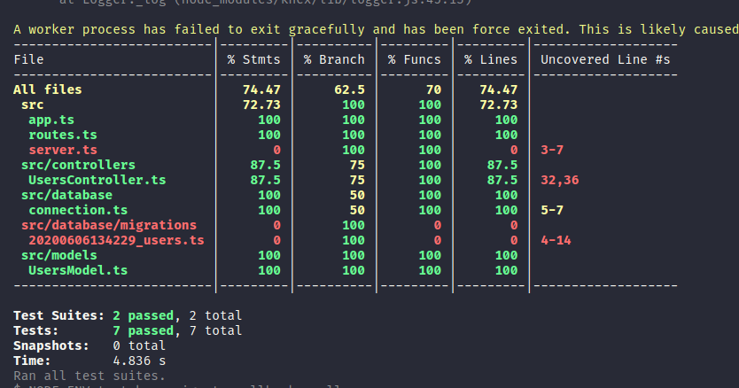

# Objetivo
Vou desenvolver uma aplicação typescript super simples, para fazer autenticação, para então criar os testes.

Para fazer todo o desenvolvimento (apenas para praticar) vou fazer uma máquina docker, mas é opcional. Caso queira seguir utilzando docker também veja esse outro tutorial [aqui](https://github.com/LucasFDutra/start-with-docker). E caso tenha problemas/duvidas com typescript, veja esse [aqui](https://github.com/LucasFDutra/start-with-TypeScript)

# O que instalar
- [node](https://nodejs.org/en/)
- [yarn](https://yarnpkg.com/)
- [docker](https://www.docker.com/)

Recomendo utilizar o docker, pois assim você pode subir a aplicação rodando apenas o comando
```shell
$ sudo docker-compose up
```

E ele instalará-tudo para você, e já deixará tudo configurado. Mas caso não queira, rode:
```shell
$ npm install
$ yarn dev
```

A aplicação vai rodar na porta 3333, então pode fazer as requestes em `http://localhost:3333`.

# Inciando com testes
Para fazer testes vamos utilizar o [jest](https://jestjs.io/pt-BR/).

- Para instalar e configurar o jest para typescript
```shell
$ yarn add jest -D
$ yarn jest --init
$ yarn add --dev babel-jest @babel/core @babel/preset-env
$ yarn add --dev @babel/preset-typescript
$ yarn add --dev @types/jest
```

- crie o arquivo `babel.config.js`
```JavaScript
// babel.config.js
module.exports = {
    presets: [
      [
        '@babel/preset-env',
        {
          targets: {
            node: 'current',
          },
        },
      ],
      '@babel/preset-typescript',
    ],
  };
```

outra opção

```shell
$ yarn add --dev jest typescript
$ yarn add --dev ts-jest @types/jest
$ yarn ts-jest config:init
```

Para ter os testes rodando, utilize o comando

```shell
$ yarn jest
```

mas podemos configurar dentro do package.json um script.
```json
  "license": "MIT",
  "scripts": {
    "test": "jest"
  },
```

Sendo assim, para rodar os teste basta digitar 
```shell
$ yarn test
```

Para termos certeza de que está tudo funcionando, vamos criar um teste simples, uma soma. Crie dois arquivos, um chamado `sum.ts` e outro `sum.test.ts`.

- `sum.ts`
```TypeScript
function sum(a: number, b: number) {
    return a + b;
  }
export default sum;
```

- `sum.test.ts`
```TypeScript
import jest from 'jest';
import sum from './sum';

it('adds 1 + 2 to equal 3', () => {
  expect(sum(1, 2)).toBe(3);
});
```

Agora rode o comando `yarn test` para executar os testes, e veja que deu certo.

Dentro do arquivo do de configurações do jest, vamos modificar algumas coisas, deixando-o da seguinte forma:

```JavaScript
module.exports = {
  bail: true,
  clearMocks: true,
  collectCoverage: true,
  collectCoverageFrom: ["src/**"],
  coverageDirectory: "__tests__",
  testEnvironment: "node",
  testMatch: [
    "**/?(*.)+(spec|test).[jt]s?(x)"
  ],
};
```

Isso ai tudo faz com que o jest veja quanto falta testar de cada arquivo contido dentro de src. e assim que rodar um teste ele salva essa informação dentro de um __tests__.

Faça o seguinte. crie uma pasta src, e coloque o arquivo de soma e o teste dela lá dentro, e mande rodar os testes, você verá em seu terminal algo parecido com isso:



Agora abra a pasta `__tests__/lcov-report` e veja que tem um arquivo `index.html`. Abra ele no seu navegador e veja que ele te retorna as informações de forma gráfica. E o melhor, lá você consegue saber até qual linha do código não foi testada ainda.


# A aplicação node
Considerando que o foco aqui não é a aplicação em sí e sim os testes, vou explicar apenas como é o fluxo da aplicação e códigos importantes dentro dela para que os testes sejam melhor aproveitados.

## app.ts e server.ts
Essas duas coisas devem ser separadas, pois quando rodarmos nosso teste não queremos startar o servidor, somente rodar a aplicação. Então os dois arquivos ficam da seguinte forma

- server.ts
    ```TypeScript
    import App from './app';

    const PORT = 3333;
    const HOST = '0.0.0.0';

    const app = App;

    app.listen(PORT, HOST);
    ```

> OBS.: O host é porque a aplicação está rodando em uma máquina docker, se esse não for seu caso, então basta retirar essas referências e rode tudo em localhost

- app.ts
```TypeScript
import express from 'express';
import cors from 'cors';
import routes from './routes';

class App {
  public express: express.Application;

  public constructor() {
    this.express = express();
    this.middlewares();
    this.routes();
  }

  private middlewares() : void {
    this.express.use(express.json());
    this.express.use(cors());
  }

  private routes() : void {
    this.express.use('/', routes);
  }
}

export default new App().express;
```

Pronto, ao fazer isso já isolamos a aplicação do servidor, e para rodar os testes não é mais necessário subir todo o servidor.